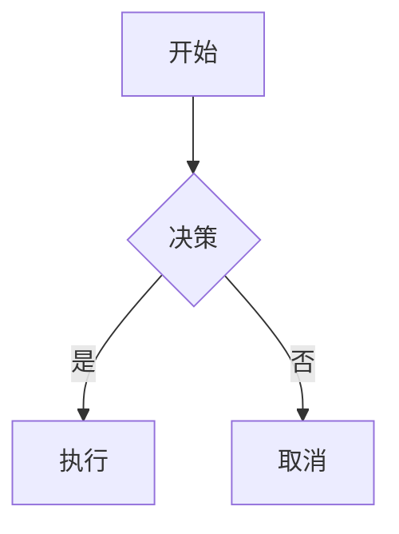

# Obsidian Skill

> [!info] 简介
> Obsidian Skills 是一套专为 Obsidian 知识管理工具设计的 Agent Skills，让 AI 能够更好地理解和使用 Obsidian 的各种功能。

---

## 一、obsidian-markdown

用于创建和编辑 Obsidian Flavored Markdown。

### 1.1 内部链接 (Wikilinks)

```markdown
[[笔记名称]]                      -- 链接到笔记
[[笔记名称|显示文本]]              -- 自定义显示文本
[[笔记名称#标题]]                  -- 链接到标题
[[笔记名称#^块ID]]              -- 链接到块
```

> [!tip] 何时使用
> 在同一保险库内的笔记使用 `[[wikilinks]]`，Obsidian 会自动追踪重命名。对于外部链接使用 `[text](url)`。

### 1.2 嵌入 (Embeds)

```markdown
![[Note Name]]                      -- 嵌入完整笔记
![[image.png|300]]                  -- 嵌入图片并指定宽度
![[document.pdf#page=3]]            -- 嵌入 PDF 指定页
```

### 1.3 Callouts 提示块

```markdown
> [!note] 基本提示
> 内容

> [!warning] 重要警告
> 带自定义标题的警告

> [!tip]- 折叠提示
> 点击可展开的提示块
```

**常用类型：** `note`、`tip`、`warning`、`info`、`success`、`question`、`failure`、`danger`、`bug`、`example`、`quote`

### 1.4 属性 (Frontmatter)

```yaml
---
title: 笔记标题
date: 2026-04-16
tags:
  - 工具
  - 教程
aliases:
  - 别名1
  - 别名2
status: in-progress
---
```

### 1.5 标签 (Tags)

```markdown
#tag                    -- 内联标签
#项目/进行中             -- 嵌套标签
```

### 1.6 数学公式 (LaTeX)

```markdown
内联公式: $E = mc^2$

块级公式:
$$
\frac{a}{b} = c
$$
```

### 1.7 Mermaid 图表

````markdown

````

---

## 二、obsidian-bases

用于创建类似数据库的视图。

### 2.1 基本结构

```yaml
filters:
  and:
    - file.hasTag("task")

formulas:
  priority_label: 'if(priority == 1, "🔴 高", "🟢 低")'

views:
  - type: table
    name: "任务列表"
    order:
      - file.name
      - status
      - priority_label
```

### 2.2 过滤器语法

```yaml
# AND 条件
filters:
  and:
    - 'status == "done"'
    - 'priority > 3'

# OR 条件
filters:
  or:
    - file.hasTag("book")
    - file.hasTag("article")
```

### 2.3 常用公式

```yaml
formulas:
  # 计算天数
  days_until_due: 'if(due, (date(due) - today()).days, "")'

  # 条件显示
  status_icon: 'if(done, "✅", "⏳")'
```

### 2.4 视图类型

| 类型 | 说明 |
|------|------|
| `table` | 表格视图 |
| `cards` | 卡片视图 |
| `list` | 列表视图 |
| `map` | 地图视图（需位置属性） |

### 2.5 示例：任务追踪器

```yaml
filters:
  and:
    - file.hasTag("task")

formulas:
  days_until_due: 'if(due, (date(due) - today()).days, "")'
  priority_label: 'if(priority == 1, "🔴", if(priority == 2, "🟡", "🟢"))'

properties:
  status:
    displayName: 状态
  formula.priority_label:
    displayName: 优先级

views:
  - type: table
    name: "任务"
    order:
      - file.name
      - status
      - formula.priority_label
      - due
      - formula.days_until_due
```

---

## 三、json-canvas

用于创建可视化画布。

### 3.1 基本结构

```json
{
  "nodes": [],
  "edges": []
}
```

### 3.2 节点类型

```json
{
  "id": "6f0ad84f44ce9c17",
  "type": "text",
  "x": 0,
  "y": 0,
  "width": 400,
  "height": 200,
  "text": "# 标题\n\n内容",
  "color": "4"
}
```

### 3.3 边连接

```json
{
  "id": "0123456789abcdef",
  "fromNode": "节点A的ID",
  "fromSide": "right",
  "toNode": "节点B的ID",
  "toSide": "left",
  "toEnd": "arrow",
  "label": "连接到"
}
```

### 3.4 颜色预设

| 预设 | 颜色 |
|------|------|
| `"1"` | 红色 |
| `"2"` | 橙色 |
| `"3"` | 黄色 |
| `"4"` | 绿色 |
| `"5"` | 青色 |
| `"6"` | 紫色 |

### 3.5 示例：项目看板

```json
{
  "nodes": [
    {
      "id": "todo-group",
      "type": "group",
      "x": 0, "y": 0,
      "width": 300, "height": 400,
      "label": "待办",
      "color": "1"
    },
    {
      "id": "task-1",
      "type": "text",
      "x": 20, "y": 50,
      "width": 260, "height": 80,
      "text": "## 任务 1\n\n描述"
    }
  ],
  "edges": []
}
```

---

## 四、obsidian-cli

用于命令行操作 Obsidian。

### 4.1 常用命令

```bash
# 创建笔记
obsidian create name="新笔记" content="# 标题"

# 读取笔记
obsidian read file="笔记名称"

# 搜索
obsidian search query="关键词" limit=10

# 每日笔记
obsidian daily:append content="- [ ] 新任务"

# 设置属性
obsidian property:set name="status" value="done"
```

### 4.2 插件开发

```bash
# 重载插件
obsidian plugin:reload id=my-plugin

# 检查错误
obsidian dev:errors

# 截图
obsidian dev:screenshot path=screenshot.png
```

---

## 五、defuddle

用于从网页提取干净的内容。

### 5.1 基本用法

```bash
# 提取为 Markdown
defuddle parse <url> --md

# 保存到文件
defuddle parse <url> --md -o content.md

# 提取元数据
defuddle parse <url> -p title
defuddle parse <url> -p description
```

### 5.2 使用示例

```bash
# 提取文章
defuddle parse https://example.com/article --md -o article.md

# 只获取标题
defuddle parse https://example.com -p title
```

---

## 附录

### 相关链接

- [Obsidian 官网](https://obsidian.md)
- [GitHub 仓库](https://github.com/kepano/obsidian-skills)
- [JSON Canvas 规范](https://jsoncanvas.org/spec/1.0/)

### 安装命令

```bash
# 更新 skills
cd ~/.opencode/skills/obsidian-skills && git pull

# 安装 defuddle
npm install -g defuddle
```

---

> [!success] 提示
> 这些 Skills 在重启 OpenCode 后自动生效，可以直接在对话中自然语言调用。

*创建日期：2026-04-16*
